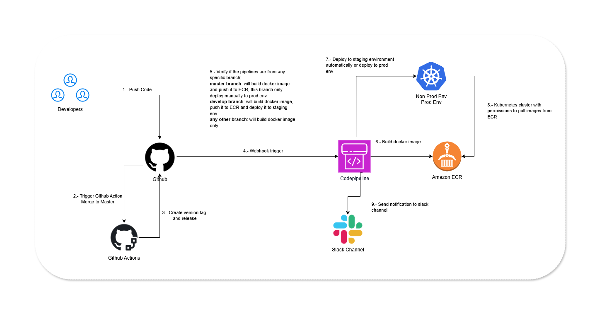
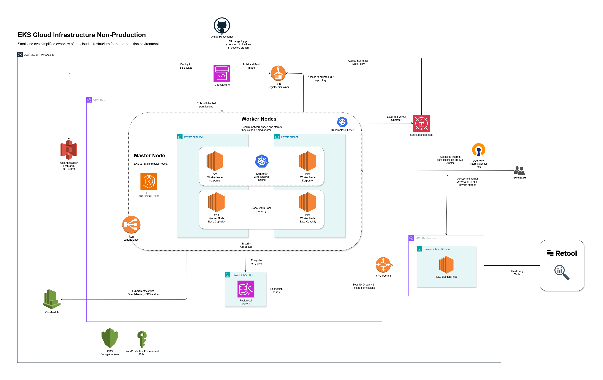

# Opsfleet

This folder contains the architecture design for Innovate Inc. startup platform. It includes cloud architecture good practices, diagrams, and recommendations for the implementation in AWS

## Cloud Provider

The recommended cloud provider is Amazon Web Services, it provides a wide range of managed services that can be configured to create scalabe, secure and cost-effective infrastructure.

# Architecture Design

This architecture solution is designed to be simple and easy to implement and maintain. It includes AWS managed services that doesn't require any complex or custom configuration.

## AWS Account Structure

The recommended configuration is to have 3 AWS accounts distributed as follows:

1. **Management Account**: This account is used to manage the organization, access control, and billing. This account is the root and should not run any workloads or services.
2. **Development Account**: This account is used for development and testing purposes. This account works as an isolated environment for developers to work on their applications.
3. **Production Account**: This account is used for production workloads only.

## Cloud Environment Structure

## CI/CD Pipelines

For the CI/CD configuration, we recommend AWS Codepipeline, this service is a fully managed CI/CD pipeline service that can be integrated with all the ecosystem of AWS.

The CI/CD configuration is integrated with the Github repository, in Github we implemented github actions to generate the version and release information as well some code quality checks, secrets, and other configurations.

In the AWS side we run the build and deployment of the frontend application to a S3 bucket and the backend application to an EKS cluster. After this process finish we send a notification of the status to the team via Slack.

### Branching Strategy

The branching strategy for the application code should implement a simplified version of the Git Flow model, which includes the following branches:

- **main**: Branch for the production-ready code.
- **develop**: Contains the latest development changes and features, this branch is used in qa/staging environments and is merged to the main branch for deployment.
- **feature/**: Used for developing new features, branched off from the develop branch.
- **bugfix/**: Used for fixing bugs, branched off from the develop branch.

This strategy helps to manage the codebase and ensure that changes are reviewed and tested before being merged into the main branch, also simplifies the configuration of the CI/CD pipelines.

## VPC Configuration

VPC is the networking layer of AWS where all resources are deployed. We implement a VPC for each environment to isolate their resources.

We defined a VPC with internal subnets where we deploy the backend application (EKS), also we defined deny all inbound traffic by default policy.

We recommend to use internet gateways to allow outbound traffic to the internet and NAT gateways to allow outbound traffic from the internal subnets to the internet.

## Application Layer

### Frontend Application

Since the application is a single page SPA (ReactJS) and the expected traffic could scale to millions of users, we recommend to deploy this application as a static website in S3.

This is a cost-effective and highly scalable solution that can handle the expected amount of traffic without any performance issues.

### Backend Application

The backend application is a containerized api service based on Python/Flask, it is deployed in an EKS cluster with Karpenter for the automated scaling of worker nodes and autoscaling of the pods.

The autoscaling configuration is optimized to use the cheapest and most efficient instance type in EC2 (ARM), since the expected traffic can grow to millions of users, we recommed to use horizontal pod scaling and limit the maximum number of worker nodes capacity acording to the company's budget.

We recommend to use a node group with 2 workers to handle a minimum of traffic and define a karpenter custom configuration that scale the worker nodes based on the CPU and memory usage of the pods (This can be improved over time with a more acurate scaling strategy).

Both applications are behind a cloudfront distribution and protected by a WAF to protect against DDoS attacks or other type of attacks, also improves the performance of the website by caching the static content.

## Data Layer

The managed service for databases in AWS we recommend is the Aurora PostgreSQL, this is because we don't want to introduce any bottleneck when scaling the application in the backend.

This service reduce the complexity of the Postgresql management and can scale automatically based on the workload.

The database is deployed in a multi-AZ configuration to ensure high availability and disaster recovery with daily backups and point-in-time recovery.

As a recommendation, we suggest define a data retention policy to ensure that the critical data is kept for a minimum time period and comply with regulatory requirements, as well to reduce costs of data storage.

## Security

We enforce the security best practices in this architecture design, all data in encrypted on rest and in transit between all the communication between the applications.

We implemented a bastion host to allow access to third party vendors to internal services and implement minimal access to all developers.

## Environments

### Non Production Environment (Develop/Staging)

### Production Environment

